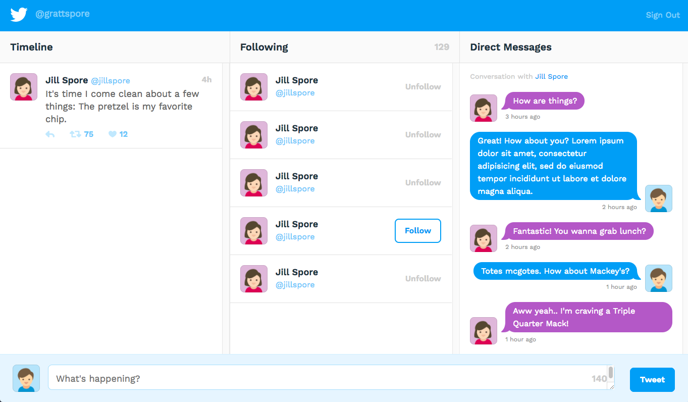

# Build a Twitter Interface 
## FullStack Tech Degree Project 7

### Node, Express, JavaScript, Pug, REST APIs

#### Getting Started
Insert your own twitter credentials to the supplied `example-config.js` file and change the filename to `config.js`.

Open a Command Prompt (on Windows) or Terminal (on Mac OS X and Linux) instance and browse to the root project folder and run the following commands:

##### Install dependencies
`npm install` Install dependencies

##### Run the application
`npm start`

##### View the application
Open your web browser and browse to http://localhost:3000/



#### Example Code
```Javascript
// Following Route
router.use((req, res, next) => {
	T.get('friends/list', {
		count: 5 // return only 5 most recent
	}, function(err, data, response) {
		res.following = data.users; // pass follower data down to next method
		next(err);
	});
});

// Messages Route
router.use((req, res, next) => {
	T.get('direct_messages', {
		count: 5 // return only 5 most recent
	}, function(err, data, response) {
		res.messages = data;
		next(err);
	});
});
```

### By Chris Mason
Aug 2017
